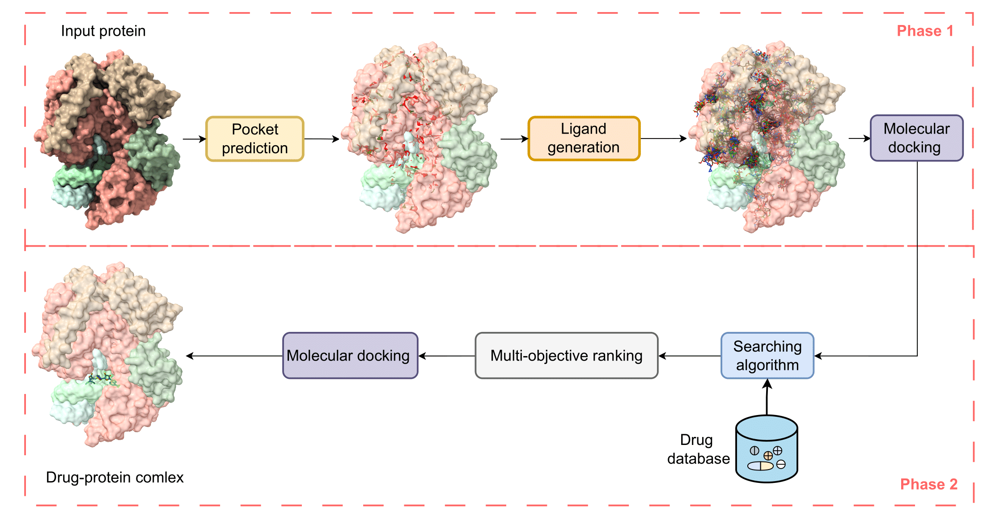

<!-- PAPER TITLE -->

# Generative AI-assisted drug discovery pipeline

<!-- TABLE OF CONTENTS -->

<details>
  <summary>Table of Contents</summary>
  <ol>
    <li><a href="#abstract">Abstract</a></li>
    <li><a href="#filestructure">Files structure</a></li>
    <li><a href="#environmentsetup">Environments setup</a></li>
    <li><a href="#citing">Citing</a></li>
  </ol>
</details>

<!-- ABSTRACT -->

## Abstract

 Drug repurposing presents a valuable strat-
egy to expedite drug discovery by identifying new ther-
apeutic uses for existing compounds, especially for dis-
eases with limited treatment options. We propose a Gen-
erative AI-assisted Virtual Screening Pipeline that com-
bines generative modeling, binding pocket prediction, and
similarity-based searches within drug databases to achieve
a generalizable and efficient approach to drug repurposing.
Our pipeline enables blind screening of any protein target
without requiring prior structural or functional knowledge,
allowing it to adapt to a wide range of diseases, including
emerging health threats and novel targets where informa-
tion is scarce. By rapidly generating potential ligands and
efficiently identifying and ranking drug candidates, our ap-
proach accelerates the drug discovery process, broadening
the scope and impact of repurposing efforts and offering
new possibilities for therapeutic development. 

<p align="center">
   <br/>
   <i>Overview of the Generative AI-assisted Drug Repurposing Pipeline. The pipeline consists of two phases: Phase 1
generates potential ligands using generative AI, and Phase 2 identifies promising drug candidates via similarity-based searches
within drug databases.</i>
 </p>

### Files structure
Files should be placed as the following folder structure:

```
root
├── assets
│   ├── hiv
│   │   │── generation
│   │   │   │── generation.csv
│   │   │── generation_docking
│   │   │   │──...
│   │   │──preprocessed_data
│   │   │   │──...
│   │   │── remove_water
│   │   │   │── 2jle.pdb
│   │   │   │── 2jle.pdbqt
│   │── covid19
│   │   │── generation
│   │   │   │── generation.csv
│   │   │── ...
├── datasets
│   ├── drugbank.csv
│   ├── drugbank_conformation
│   │   ├── DB00114.sdf
│   │   ├── DB00116.sdf
│   │   ├── ...
├── search_dgi
├── diffusion_generate
├── e3gnn_utils.py
├── e3gnn.py
├── equiformer.py
├── gat.py
├── pipeline_gnn.py
├── utils.py
├── README.md
```
### Environments setup
Please install the environments by the following command:
```
conda env create --name pipeline --file=pipeline.yml
```
### Usage
0. Conformer generation:
    ```
    cd datasets/
    python generate_conformation.py
    ```
1. Run pipeline with gnns searching methods dataset:
    ```
    python pipeline_gnn.py 0
    ```

2. Run gat searching methods dataset:
    ```
    python gat.py
    ```
3. Run equiformer searching methods dataset:
    ```
    python equiformer.py
    ```
4. Run e3gnn searching methods dataset:
    ```
    python e3gnn.py
    ```

<!-- CITING -->

## Citing

```
@inproceedings{
velickovic2018deep,
title="{Deep Graph Infomax}",
author={Petar Veli{\v{c}}kovi{\'{c}} and William Fedus and William L. Hamilton and Pietro Li{\`{o}} and Yoshua Bengio and R Devon Hjelm},
booktitle={International Conference on Learning Representations},
year={2019},
url={https://openreview.net/forum?id=rklz9iAcKQ},
}
```
```
@misc{Gordić2020PyTorchGAT,
  author = {Gordić, Aleksa},
  title = {pytorch-GAT},
  year = {2020},
  publisher = {GitHub},
  journal = {GitHub repository},
  howpublished = {\url{https://github.com/gordicaleksa/pytorch-GAT}},
}
```
```
@inproceedings{
    liao2023equiformer,
    title={Equiformer: Equivariant Graph Attention Transformer for 3D Atomistic Graphs},
    author={Yi-Lun Liao and Tess Smidt},
    booktitle={International Conference on Learning Representations},
    year={2023},
    url={https://openreview.net/forum?id=KwmPfARgOTD}
}
```
```
@article{brandstetter2021geometric,
      title={Geometric and Physical Quantities improve E(3) Equivariant Message Passing},
      author={Johannes Brandstetter and Rob Hesselink and Elise van der Pol and Erik Bekkers and Max Welling},
      year={2021},
      eprint={2110.02905},
      archivePrefix={arXiv},
      primaryClass={cs.LG}
}
```
```
Eberhardt, J., Santos-Martins, D., Tillack, A.F., Forli, S. (2021). AutoDock Vina 1.2.0: New Docking Methods, Expanded Force Field, and Python Bindings. Journal of Chemical Information and Modeling.
```
